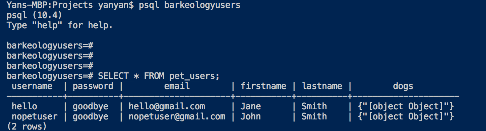

# bark-eology
Pet information for prospective owners, and current owners of dogs. For better zoomies, sploots, tippytats, and boops. Furreal.

## Introduction
A mockup of a signin and account verification using PostgresSQL, React, Webpack, and Express in the node environment.

Project will be continuously built to represent dog information as "cards" and will be updating the user interface over time.

This project is intended to create a user friendly responsive web page to find out more about dog breeds for current owners and prospective owners. 


## Getting Started

Fork and download this repository to be used.

Create a database to be used. Here my credentials are displayed to connect to Postgres client on the backend.

Under db.js in db, you can modify your credentials to reflect as appropriately.

'user' : 'your computer username'

'database': 'the databasename chosen for postgres' => I have picked pet_users

You may setup a password as well. I have not on my own end but left it up there for configuration.

Postgres's own port is defaulted to 5432.

Use psql "databasename" without the quotation marks on another terminal.


## Installation

Start the local host server in the directory of the repository downloaded.

On another terminal, start building the files to be served on your local host
```
npm run build
```

On a separate terminal, start the server on your local host on port 3000
```
npm start
```

## Information

Postgres usernames are unique. The mandatory fields in PSQL are currently username, password, email, first name, and last name.

Having a pet is not a mandatory field as there are prospective owners, and for owners with multiple pets will be stored as an object.


## Screenshots of database users

Screenshots are showing object queries as text [] instead of jsbonb

Shows the current database user below with pet added


Shows the current database users below with a no pet user added



## Features to be built
A card interface for each different types of breeds and a modal type popup for users to easily view and browse.

Better homepage and design of the front page

User account login webpage to display pet information and projected ideal weight with mixed breeds on select option for each pet.